## Architecture Design

The proposed system — **EurekaClaw** — synthesizes these works into a layered architecture specifically optimized for *theoretical research* (proof-heavy, formalism-rich, math-dense domains like ML theory, physics, CS theory, and pure math).

Let me draw the full system architecture first:

Now let me zoom into the most critical inner loop — the Theory Agent and its reasoning pipeline, which is unique to *theoretical* research:

Now the continual learning loop, showing how the system improves across research runs:

---

## Full Architecture Design Document

Here's the complete specification for **EurekaClaw**, synthesizing all related works:

------

### 1. Input Layer

Accepts three entry modes inspired by AI-Researcher's two-level input design, extended to a third:

**Level 1 — Detailed idea**: user provides a formal conjecture, intuition, or partial proof sketch. The system fleshes out implementation strategy directly.

**Level 2 — Reference-based**: user submits papers. The system identifies unexplored gaps using DeepInnovator-style literature decomposition into structured cognitive primitives (Insight, Research Trending, Serendipity).

**Level 3 — Open exploration**: user gives a domain (e.g., "sample complexity of transformers"). The system autonomously surveys the frontier, generates hypotheses, and selects the most promising direction.

------

### 2. Meta-Orchestrator

The central brain, drawing from AI-Researcher's Divergent-Convergent Discovery Framework — generating five conceptually distinct research directions in the divergent phase, then evaluating them against Scientific Novelty, Technical Soundness, and Transformative Potential. Responsibilities:

- Decompose the research problem into a `tasks.json` pipeline (à la Dr. Claw's `inno-pipeline-planner`)
- Route tasks to specialized agents
- Manage approval gates at key transition points (survey→ideation, ideation→theory, theory→paper)
- Handle retries and fallback chains

------

### 3. Specialized Agent Team

**Survey Agent** — deep literature search using arXiv, Semantic Scholar, MathSciNet, and ACM DL. Produces a structured survey with citation graph, open problems, and key mathematical objects.

**Ideation Agent** — RL-trained (DeepInnovator-style GRPO with a separate discriminator/scorer, preventing reward hacking). Generates novel hypotheses, identifies cross-disciplinary connections, and ranks ideas by impact vs. feasibility.

**Theory Agent** (unique to theoretical research) — the most complex sub-agent, running a multi-stage inner loop:

- *Formalization*: translates informal intuition into rigorous mathematical notation
- *Lemma decomposition*: breaks a target theorem into a DAG of sub-goals
- *Proof attempt*: combines LLM chain-of-thought with a symbolic solver (Lean4 or Coq integration for formal verification)
- *Verification*: checks each lemma formally or via structured peer-agent review
- *Counterexample search*: when proofs fail, uses adversarial agents to falsify the conjecture and suggest refinements
- *Refinement*: updates conjectures and re-routes

Resource Analyst sub-agents (from AI-Researcher) decompose complex research concepts into atomic components with explicit bidirectional mappings between mathematical formulations and code implementations, dramatically reducing hallucination risks.

**Experiment Agent** — validates theoretical results empirically. Handles code generation, sandboxed execution (Docker), numerical validation, and ablations. Supports Claude Code, Gemini CLI, and Codex as backend engines.

**Writer Agent** — hierarchical LaTeX generation from structured research artifacts. Handles theorem environments, cross-references, citations, figures, and response-to-reviewers drafts.

------

### 4. Shared Knowledge Bus

All agents communicate through structured artifacts rather than raw text. Artifacts include a `research_brief.json` (formalized problem statement), a `theory_state.json` (proven lemmas, open sub-goals, failed attempts), a `bibliography.bib`, and experiment result JSON. This is the "structured knowledge exchange" mechanism from AI-Researcher's comprehensive multi-agent architecture where specialized components collaborate through structured knowledge exchange to maintain coherent reasoning throughout the research process.

------

### 5. Memory, Skills, and Tools

**Memory store** runs three tiers: within-session episodic memory (EvoScientist-style), cross-session persistent memory (user preferences, past results, failed conjectures), and a cross-project knowledge graph linking related theorems.

**Skills bank** mirrors Dr. Claw's 100+ research skills spanning ideation, code survey, experiment development and analysis, paper writing, review, and delivery, automatically discovered by agents and applied as task-level assistance. For theoretical research, dedicated skills cover proof strategies (induction, contradiction, compactness arguments), complexity analysis templates, and domain-specific notation conventions.

**Tool registry** includes web search, arXiv API, Semantic Scholar API, code execution sandbox, LaTeX compiler, Lean4/Coq interface, Wolfram Alpha (symbolic math), and a citation manager.

------

### 6. Continual Learning Loop

Directly implements MetaClaw's proxy-based architecture: a gateway that intercepts interactions, injects relevant skills at each turn, and meta-learns from accumulated experience. Three modes:

- `skills_only` (default): skills injected per stage, auto-evolved after each run via LLM session summarization. No GPU needed.
- `rl`: adds GRPO fine-tuning via cloud LoRA. A Process Reward Model (PRM) judges proof trajectories and scores reasoning chains. Training runs asynchronously; weights hot-swapped on completion.
- `madmax`: skills + scheduled RL, using OMLS (Opportunistic Meta-Learning Scheduler) to defer training to idle windows, preventing interference with active sessions.

The AutoResearchClaw cross-run knowledge transfer pattern applies: after each run, failures and warnings are captured as lessons, converted into reusable skills stored in `~/.metaclaw/skills/`, and injected into all pipeline stages on subsequent runs.

------

### 7. Evaluation Layer

Built on Scientist-Bench methodology: a comprehensive benchmark enabling standardized assessment, with curated research instructions, references, and datasets derived from peer-reviewed papers, enabling direct comparison between AI-generated and human scientific contributions through multidimensional evaluation standards.

Evaluation dimensions specific to theoretical research: formal correctness (verified by proof assistant), novelty (semantic similarity to existing literature), depth (proof length and complexity), citation coverage (how well the survey captured relevant prior work), and experimental alignment (whether numerical results match theoretical bounds).

------

### 8. Implementation Roadmap

**Phase 1 — Infrastructure**: Deploy OpenClaw gateway + skill platform. Integrate arXiv/S2 search tools. Build the `tasks.json` pipeline schema.

**Phase 2 — Core agents**: Survey, Ideation (with DeepInnovator RL model), and Writer agents. Validate on a benchmark domain (e.g., generalization bounds in ML theory).

**Phase 3 — Theory Agent**: Add formalization + lemma decomposition. Integrate Lean4 for formal verification. Build counterexample search loop.

**Phase 4 — Learning loop**: Add MetaClaw proxy layer, PRM scoring, cloud LoRA fine-tuning. Measure composite robustness improvement across runs.

**Phase 5 — Evaluation**: Deploy Scientist-Bench suite. Run comparison against AI-Researcher, EvoScientist, and human baselines.

------

### Key Differentiators from Existing Systems

| Feature                     | AI-Researcher | EvoScientist | Dr. Claw | EurekaClaw                 |
| --------------------------- | ------------- | ------------ | -------- | -------------------------- |
| Formal proof loop           | No            | No           | No       | **Yes (Lean4/Coq)**        |
| Continual RL                | No            | No           | No       | **Yes (MetaClaw)**         |
| Counterexample search       | No            | No           | No       | **Yes**                    |
| Math→code bidirectional map | Yes           | No           | No       | **Yes**                    |
| Cross-run skill transfer    | No            | No           | No       | **Yes (AutoResearchClaw)** |
| Human-on-the-loop           | No            | Yes          | No       | **Yes**                    |
| Formal verification         | No            | No           | No       | **Yes**                    |

The core thesis is that theoretical research requires a qualitatively different proof-reasoning loop that no current system has — and that this loop, combined with MetaClaw-style continual improvement, creates a system that gets better at mathematical reasoning with every paper it attempts to write.